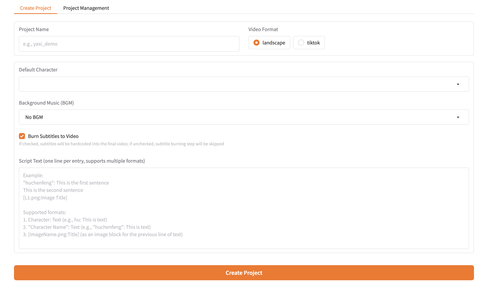

# 🎮 GamePlayVideoMaker — Automated Gameplay-Background Video Generator for Shorts

> **Give me a script, and I’ll give you a short video — gameplay as background, narration as the focus.**  
> *Built for TikTok / YouTube Shorts style explainer videos.*

GamePlayVideoMaker is an **AI-powered automated video generation tool** designed for creating short-form explainer and commentary videos.

It generates videos where:

- 🎮 **Gameplay footage is used purely as a dynamic background**
- 🎙️ **TTS-generated narration is the core content**
- 🖼️ **Images / diagrams are overlaid to support explanations**
- ❗ **The spoken content is NOT related to the gameplay itself**

This format is commonly used for TikTok / Shorts educational, storytelling, and commentary videos.

**Input:** narration script + optional images  
**Output:** a publish-ready short video (9:16 or 16:9)

**[中文版本](README_CN.md) | [English](README.md)**

---

## 🎥 What This Tool Is For

GamePlayVideoMaker is specifically designed to produce videos like:

- Technical explanations
- Knowledge-based storytelling
- Commentary / opinion videos
- Educational shorts
- Narrative voice-over content

Where:

> **The gameplay only provides visual motion and retention —  
> the actual information comes from the voice and images.**

This mirrors a popular Shorts / TikTok production style.

---
## 🎬 Generated Video Examples

### 🇨🇳 Chinese · Vertical Shorts Style
<video src="example/video/chinese_example.mp4" width="320" controls></video>

---

### 🇺🇸 English · Vertical Shorts Style
<video src="example/video/english_example.mp4" width="320" controls></video>

Narration-based explainer video  
Gameplay is used purely as visual background.

> Gameplay footage in all examples is used **only as background** and does not affect the narration content.

---

## 🧠 Core Features

- 🎮 Gameplay video as looping or trimmed background
- 🎙️ High-quality TTS narration (multi-speaker supported)
- 🖼️ Image / diagram overlay synced to narration
- 📝 Automatic subtitle generation & alignment
- 🔊 Audio normalization and mixing
- 📐 Vertical (9:16) and horizontal (16:9) support
- 🔁 JSON-driven pipeline with block-level regeneration
- ⚙️ Fully automated batch generation

---

## 🚀 Project Overview

The goal of GamePlayVideoMaker is simple:

> **Automate the creation of Shorts-style explainer videos using gameplay as visual background.**

The pipeline handles everything except writing the script:

1. TTS narration generation  
2. Background gameplay video processing  
3. Image / diagram overlay  
4. Subtitle generation & timing  
5. Final video composition & export  

This makes it suitable for:

- TikTok / Shorts content creators
- Knowledge-based channels
- Educational automation
- High-volume short video production

---

## 🖥️ Web UI (Gradio)



Launch the interface:

```bash
python videogen/gradio_app.py
````

Environment variables:

Copy `.env_example` → `.env` and fill in required API keys.

---

## 🤖 Models & Components

* **Text-to-Speech:** GPT-SoVITS (supports custom voices & characters)
* **LLM (script parsing / timing / layout):** DeepSeek-V3
* **Video Processing:** MoviePy / FFmpeg
* **UI:** Gradio

> Gameplay footage is provided externally and is **not generated by AI**.

---

## 📺 Content Attribution

Most videos published on the following Bilibili account are generated using **GamePlayVideoMaker**:

🔗 **[https://space.bilibili.com/109455236](https://space.bilibili.com/109455236)**

---
